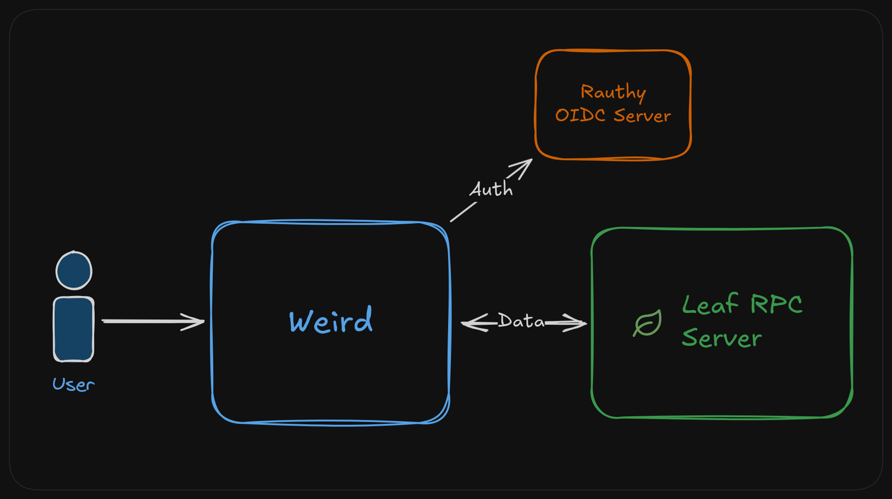

# Architecture

This describes the current architecture in Weird. Many of the pieces are experimental and may change
before we get to updating this document. Always feel free to join chat or open a discussion if you
have questions!

## Overview

Weird is made up of 3 different services: **Weird** itself, the **Rauthy** auth server, and the
**Leaf RPC server**.

<small> _Leaf icon by <a href="https://github.com/jtblabs/jtb-icons?ref=svgrepo.com"
target="_blank">Jtblabs</a> in Logo License via <a href="https://www.svgrepo.com/"
target="_blank">SVG Repo</a>._ </small>

### Weird

The Weird service is the main application. It is written using [SvelteKit] and TypeScript.

The entire web experience is implemented in the Weird service, and it includes both the browser
frontend, and the backend server-side logic. If you want to make a change to something that a user
can see or interact with, it is in the Weird service.

Data modeling is also done in the Weird service. So if we need to store a new kind of data, or
create a new kind of page, all those changes will happen in Weird.

[SvelteKit]: https://kit.svelte.dev

### Rauthy

[Rauthy] is the auth server used by Weird. It provides login and OIDC functionality, so that other
services can use Weird as an identity provider.

Rauthy is not exposed directly, but all of it's HTTP endpoints, which are prefixed with `/auth/v1`,
are proxied by the Weird service to the Rauthy server. The Weird server also overrides many of the
endpoints the provide customized versions of the UI for logging-in, etc. so that we can give an integrated look-and feel.

[Rauthy]: https://github.com/sebadob/rauthy

### Leaf RPC Server ( LRPCS )

The Leaf RPC server is Weird's "database". The Leaf server implements a draft version of the [Leaf
Protocol][lpd], and exposes a WebSocket interface so that it can be controlled by Weird.

The Leaf server can also connect to other Leaf servers though the Leaf protocol. This will
eventually allow Weird to federate with other Weird instances, and synchronize with offline-capable
desktop applications in the future.

Because the Leaf RPC server is implemented in Rust, the RPC interface is meant to allow it to be
easily accessed from the SvelteKit server, and the connection is only meant for use by the server.
It is completely separate from the p2p connections allowed by the Leaf protocol.

For a high-level overview of the Leaf protocol see [Introducing The Leaf Protocol][itlp]

[lpd]: https://github.com/muni-town/agentic-fediverse/blob/master/leaf-protocol-draft.md#leaf-protocol-draft
[itlp]: https://zicklag.katharos.group/blog/introducing-leaf-protocol/
